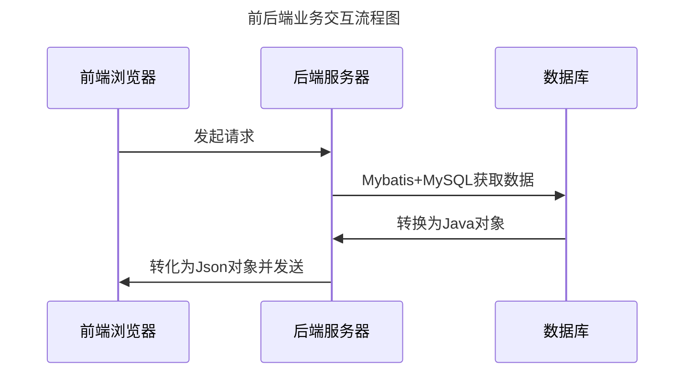
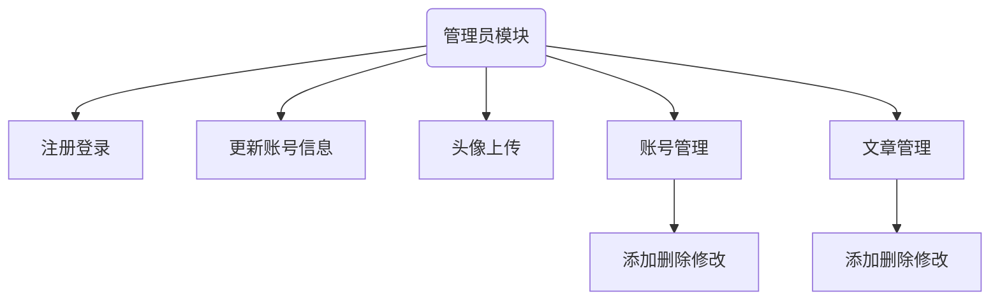
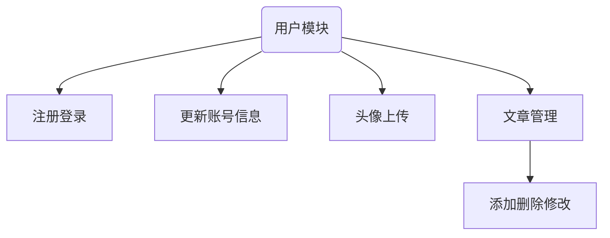

# java EE 期末作业

---
## 数据库表设计
### 员工表
|      字段       |      类型      |     说明      |
|:-------------:|:------------:|:-----------:|
|      id       |     int      | PRIMARY KEY |
|   username    | varchar(255) |             |
|   password    | varchar(255) |             |
|     role      | varchar(255) |             |
|      age      | varchar(255) |             |
|  description  | varchar(255) |             |
| department_id |     int      |             |
|     name      | varchar(255) |             |
|      sex      | varchar(255) |             |
|      no       | varchar(255) |   UNIQUE    |
|    avatar     | varchar(256) |             |

```mysql
create table employee
(
    id            int auto_increment comment 'ID'
        primary key,
    username      varchar(255) null comment '用户名',
    password      varchar(255) null comment '密码',
    role          varchar(255) null comment '角色',
    age           int          null comment '年龄',
    description   longtext     null comment '个人介绍',
    department_id int          null comment '部门',
    name          varchar(255) null comment '名称',
    sex           varchar(255) null comment '性别',
    no            varchar(255) null comment '工号',
    avatar        varchar(255) null comment '图片',
    constraint no
        unique (no)
)
    comment '员工信息表';
```
### 文章表
| 字段          | 类型           | 说明          |
|-------------|--------------|-------------|
| id          | int          | primary key |
| title       | varchar(256) |             |
| img         | varchar(256) |             |
| description | varchar(256) |             |
| content     | longtext     |             |
| time        | varchar(256) |             |
```mysql
create table article
(
    id          int auto_increment comment 'ID'
        primary key,
    title       varchar(255) null comment '标题',
    img         varchar(255) null comment '封面',
    description varchar(255) null comment '简介',
    content     longtext     null comment '内容',
    time        varchar(255) null comment '发布时间'
)
    comment '文章信息' collate = utf8mb4_unicode_ci;
```
### admin
| 字段       | 类型           | 说明          |
|----------|--------------|-------------|
| id       | int          | primary key |
| username | varchar(256) |             |
| password | varchar(256) |             |
| name     | varchar(256) |             |
| role     | varchar(256) |             |
```mysql
create table article
(
    id          int auto_increment comment 'ID'
        primary key,
    title       varchar(255) null comment '标题',
    img         varchar(255) null comment '封面',
    description varchar(255) null comment '简介',
    content     longtext     null comment '内容',
    time        varchar(255) null comment '发布时间'
)
    comment '文章信息' collate = utf8mb4_unicode_ci;
```

---
## 数据模型设计
### Employee用户模型
|      字段       | 类型      | 说明   |
|:-------------:|---------|------|
|      id       | Integer | ID   |
|   username    | string  | 用户名  |
|   password    | string  | 密码   |
|     role      | string  | 角色   |
|     name      | string  | 名称   |
|      sex      | string  | 性别   |
|      no       | string  | 工号   |
|      age      | Integer | 年龄   |
|  description  | string  | 个人介绍 |
| department_id | int     | 部门ID |

### Article
| 字段          | 类型          | 说明   |
|-------------|-------------|------|
| id          | Integer     | ID   |
| title       | string      | 文章标题 |
| img         | img         | 文章封面 |
| description | description | 简介   |
| content     | content     | 内容   |
| time        | time        | 发布时间 |

### Admin
| 字段       | 类型      | 说明  |
|----------|---------|-----|
| id       | Integer | ID  |
| username | string  | 用户名 |
| password | string  | 密码  |
| role     | string  | 角色  |
| name     | string  | 名称  |

### Account
| 字段          | 类型      | 说明  |
|-------------|---------|-----|
| id          | Integer | ID  |
| username    | string  | 用户名 |
| password    | string  | 密码  |
| role        | string  | 角色  |
| name        | string  | 名称  |
| newPassword | string  | 新密码 |
| avatar      | string  | 头像  |
---

## 前后端接口
### 网页接口
| 接口         | 方法   | 描述 |
|:-----------|------|----|
| /register  | POST | 注册 |
| /login     | POST | 登录 |


### 员工接口
|     /employee      | 方法     | 描述       |
|:------------------:|--------|----------|
|      /updata       | POST   | 更新员工数据   |
|        /add        | POST   | 添加员工     |
|    /selectPages    | GET    | 分页查询     |
|  /selectById/{id}  | GET    | 根据id查询用户 |
|     /selectAll     | GET    | 查询所有用户   |
|  /deleteById/{id}  | DELETE | 根据id删除用户 |
|    /deleteBatch    | DELETE | 批量删除     |

### 管理员接口
|       /admin       | 方法     | 描述     |
|:------------------:|--------|--------|
|      /updata       | POST   | 更新信息   |
|        /add        | POST   | 添加用户   |
|    /selectPages    | GET    | 分页查询   |
|  /selectById/{id}  | GET    | 根据id查询 |
|     /selectAll     | GET    | 查询所有   |
|  /deleteById/{id}  | DELETE | 根据id删除 |
|    /deleteBatch    | DELETE | 批量删除   |

### 文章接口
| /article         | 方法     | 描述       |
|------------------|--------|----------|
| /updata          | POST   | 更新文章     |
| /add             | POST   | 添加文章     |
| /selectPages     | GET    | 分页查询     |
| /selectById/{id} | GET    | 根据id查询用户 |
| /selectAll       | GET    | 查询所有     |
| /deleteById/{id} | DELETE | 根据id删除文章 |
| /deleteBatch     | DELETE | 批量删除     |
---

## 架构

## 功能模块图
### 管理员

### 用户

---

[接口测试页面](http://localhost:8080/swagger-ui/index.html)

**[注意该处数据库修改为自己的数据库连接配置](src/main/resources/application.yml)**
