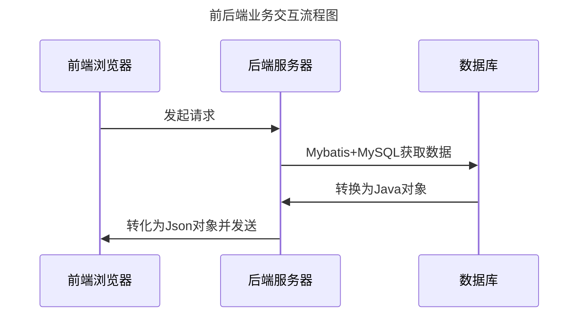

# java EE 期末作业

---
**[注意该处数据库修改为自己的数据库连接配置](src/main/resources/application.yml)**

---

## 数据库表设计
|    字段         |       类型       |      说明       |
|:-------------:|:--------------:|:-------------:|
|      id       |      int       |  PRIMARY KEY  |
|   username    |  varchar(255)  |               |
|   password    |  varchar(255)  |               |
|     role      |  varchar(255)  |               |
|     name      |  varchar(255)  |               |
|      sex      |  varchar(255)  |               |
|      age      |  varchar(255)  |               |
|      no       |  varchar(255)  |    UNIQUE     |
|  description  |  varchar(255)  |               |
| department_id |      int       |               |

---

## 数据模型设计
### Employee用户模型
|      字段       | 类型     | 说明   |
|:-------------:|--------|------|
|   username    | string | 用户名  |
|   password    | string | 密码   |
|     role      |        |      |
|  description  | string | 个人介绍 |
| department_id | int    | 部门ID |
|      sex      | string | 性别   |
|      no       | string | 工号   |
---
## 流程图

---

