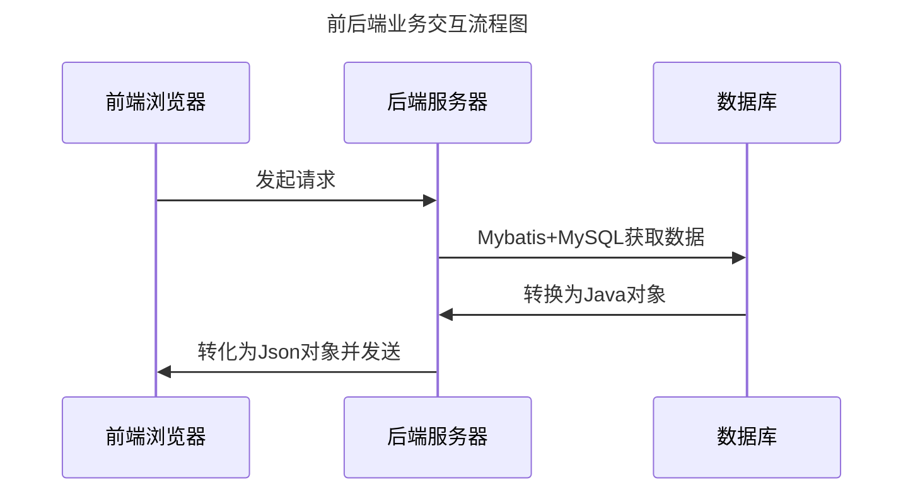

# java EE 期末作业

---
[接口测试页面](http://localhost:8080/swagger-ui/index.html)

## 网页接口
| 接口         | 描述     |
|:-----------|--------|
| /register  | 注册     |
| /login     | 登录     |
| /weather   | 返回天气   |
| /map       | 返回json |
| /hello     | hello  |
| /count     | 抛出异常   |

## 员工接口
| /employee        | 描述       |
|------------------|----------|
| /updata          | 更新员工数据   |
| /add             | 添加员工     |
| /selectPages     | 分页查询     |
| /selectById/{id} | 根据id查询用户 |
| /selectAll       | 查询所有用户   |
| /deleteById/{id} | 根据id删除用户 |
| /deleteBatch     | 批量删除     |

## 管理员接口
| /admin           | 描述     |
|------------------|--------|
| /updata          | 更新信息   |
| /add             | 添加用户   |
| /selectPages     | 分页查询   |
| /selectById/{id} | 根据id查询 |
| /selectAll       | 查询所有   |
| /deleteById/{id} | 根据id删除 |
| /deleteBatch     | 批量删除   |
---
## git 操作

每次提交代码前都要更新远程仓库到本地
```
git pull
```

更新功能时可在自己创建的分支更新
```
git branch dev          # 创建分支 dev, 如已有可不用创建
git branch              # 查看当前所在分支
git switch dev          # 切换到分支 dev
git add .               # 添加代码
git commit -m "更新描述"  # 提交代码  
```

然后到 main 分支合并 dev 分支的代码
```
git switch main         # 切换到主分支
git merge dev           # 合并 dev 分支代码到当前 main 分支
```

最后更新代码到远程
```
git pull                # 拉取最新的远程代码到主分支，也就是 main 分支
git push origin main    # 推送到远程仓库
```

**注意**
如果 **git pull** 时出现该警告
```
hint: You have divergent branches and need to specify how to reconcile them.
hint: You can do so by running one of the following commands sometime before
hint: your next pull:
hint: 
hint:   git config pull.rebase false  # merge
hint:   git config pull.rebase true   # rebase
hint:   git config pull.ff only       # fast-forward only
hint: 
hint: You can replace "git config" with "git config --global" to set a default
hint: preference for all repositories. You can also pass --rebase, --no-rebase,
hint: or --ff-only on the command line to override the configured default per
hint: invocation.
fatal: Need to specify how to reconcile divergent branches.
```
**请使用以下方法解决**
```
# 1. 使用变基方式拉取远程更新（推荐）
git pull --rebase origin main

# 2. 如果出现冲突：
#    - 用编辑器解决冲突文件（搜索 >>>>> 标记）
#    - 标记冲突已解决
git add 冲突文件名

#    - 继续变基操作
git rebase --continue

# 3. 成功变基后推送更新
git push origin main
```

---
## 流程图

---
**[注意该处数据库修改为自己的数据库连接配置](src/main/resources/application.yml)**

---
## 数据库表设计
|      字段       |       类型       |      说明       |
|:-------------:|:--------------:|:-------------:|
|      id       |      int       |  PRIMARY KEY  |
|   username    |  varchar(255)  |               |
|   password    |  varchar(255)  |               |
|     role      |  varchar(255)  |               |
|     name      |  varchar(255)  |               |
|      sex      |  varchar(255)  |               |
|      age      |  varchar(255)  |               |
|      no       |  varchar(255)  |    UNIQUE     |
|  description  |  varchar(255)  |               |
| department_id |      int       |               |

---

## 数据模型设计
### Employee用户模型
|      字段       | 类型     | 说明   |
|:-------------:|--------|------|
|   username    | string | 用户名  |
|   password    | string | 密码   |
|     role      | string | 角色   |
|  description  | string | 个人介绍 |
| department_id | int    | 部门ID |
|      sex      | string | 性别   |
|      no       | string | 工号   |
---

---
## bug
| 地址                | bug内容  | 建议修复     |
|-------------------|--------|----------|
| /manager/Employee | 可以删除自身 | 添加用户注销功能 |

