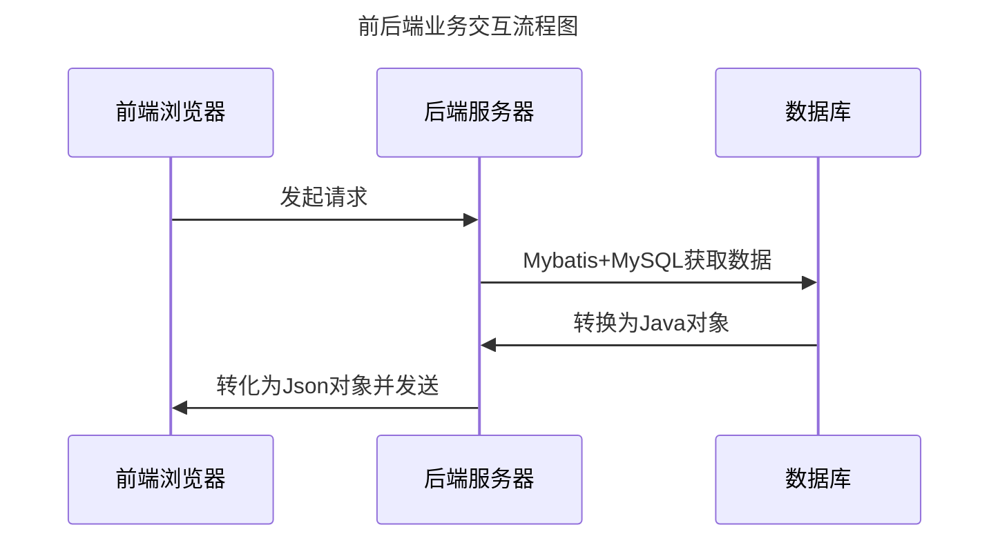

# java EE 期末作业

---
**[注意该处数据库修改为自己的数据库连接配置](src/main/resources/application.yml)**

---
## 流程图

---
## 数据模型设计
### Employee用户模型
| 字段       | 类型     |说明|
|----------|--------|-|
| username | string ||
| password | string ||
| role     |||

